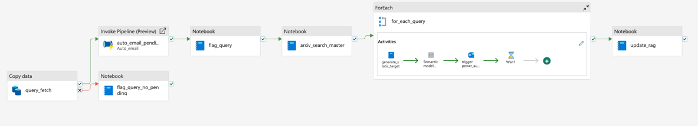
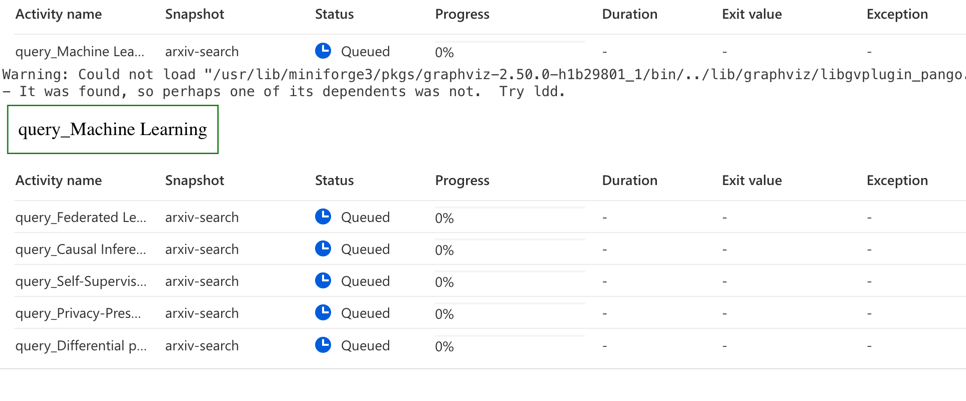
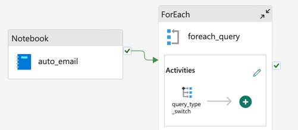
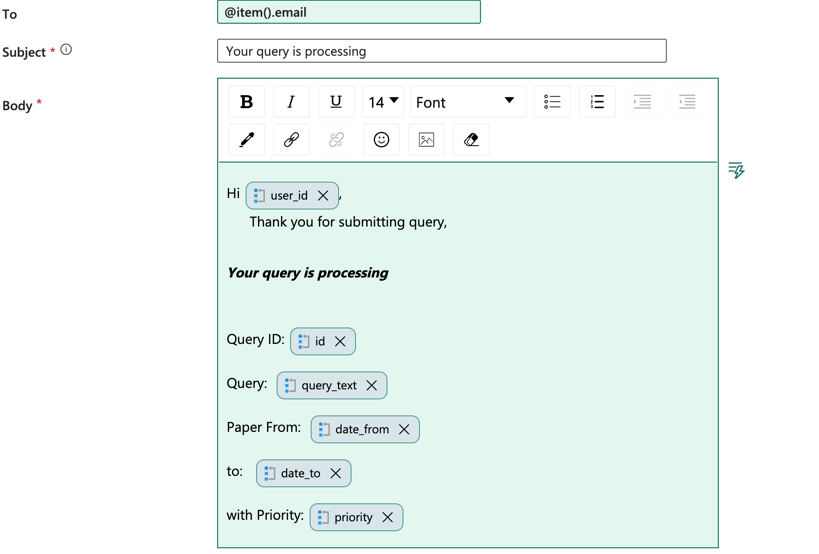
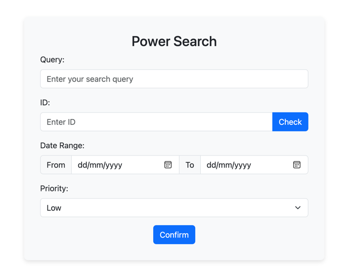
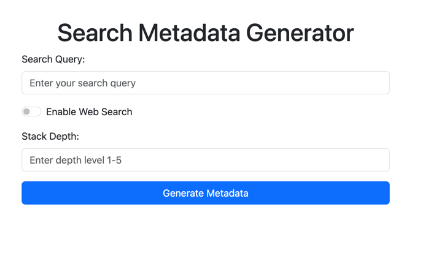

# Research_Of_Research

## Overview
Research of Research is an automated platform that manages research queries, gathers and organizes relevant research data, and delivers actionable insights directly to users. Leveraging multiple APIs and AI-driven tagging, the system fetches, processes, and enriches metadata from scholarly databases. It updates reports dynamically in Power BI and sends them to users, ensuring they have access to the latest academic insights. Additionally, the platform continuously updates its AI-powered search index, making it a powerful tool for discovering new information with ease.

### Main Pipeline

### Structure

## arxiv_api_related folder

### arxiv_search_master.ipynb
arxiv_search_master manages a spark pool that concurrently searches for research papers on the arXiv repository. It uses the arxiv-search.ipynb file to search for papers and retrieve their metadata.
arxiv_search_master will call the arxiv-search.ipynb file to search for papers and retrieve their metadata and also call the arxiv-tag.ipynb to tag the papers with AI-driven tags. 
The AI-driven tags are used to cluster the papers into different field

- hierachy: 
  - arxiv_search_master.ipynb
    - arxiv-search.ipynb
      - arxiv-tag.ipynb

### arxiv-search.ipynb
The arxiv-search.ipynb file is a Jupyter Notebook that contains code and documentation for searching and retrieving research papers from the arXiv repository.

#### pipeline parameters
>query_id = ""\
query = ""\
paper_num = 0\
date_from = ""  
date_to = ""

### arxiv-tag.ipynb

The arxiv-tag.ipynb file is a Jupyter Notebook that contains code and documentation for tagging research papers with AI-driven tags. The tags are used to cluster the papers into different fields and topics.
#### pipeline parameters
>filename = ""

## pipeline_related

### auto_email.ipynb

auto_email.ipynb is a Jupyter Notebook that contains code and documentation for generate iterative objects for email sending. 
Following this notebook is a ForEach activity in microsoft fabric.

auto_email exports a query_list objects.
And we will use `@array(json(activity('auto_email').output.result.exitValue).query_list)`
expression to iterate it in ForEach activity to generate dynamic notification.

### query_flag.ipynb
query_flag.ipynb is a Jupyter Notebook that contains code and documentation for flagging query status on CosmosDB.

### update_rag.ipynb
update_rag.ipynb is a Jupyter Notebook that contains code and documentation for updating the papers index on azure AI search.
It first loads all the query results into cosmosdb , then utilize indexer to update the index on azure AI search.

### static_report_generator.ipynb
static_report_generator is simply a notebook for writing data into the target dataset reffered by the powerbi report.

### Frontend
The frontend folder `fabric_flask` contains the code for the Research of Research web application. The web application allows users to submit research queries, view the status of their queries, and access the latest research insights. The frontend is built using Flask.

#### RAG Interface

User can chat using the RAG interface to get the latest research insights.

#### MetaData Store
Place that stores and manages the metadata of the query.

#### Power Search

Place for submitting and configuring queries.

####  Search Metadata Generator

Place for generating metadata for the search using Bing Search API and OPenai API.

